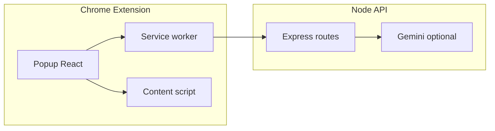

# Neuro-Inclusive Web Interface

Chrome Extension (Manifest V3) plus a small Node.js API that can use **Google Gemini** for text simplification and summarization. The extension also works **without API keys**: the server and the extension apply **local fallbacks** so demos do not break.

---

## Problem statement

The web is often visually noisy and linguistically dense: ads, autoplay, long sentences, and inconsistent typography raise **cognitive load**. For many neurodivergent readers (e.g. ADHD, dyslexia, autism), that friction turns everyday reading into a draining task.

---

## Solution overview

**Neuro-Inclusive Web Interface** layers accessibility controls onto any site the user visits:

- **Reading adjustments**: themes, font size, spacing, optional narrow column, bionic-style emphasis, reading ruler.
- **Focus and calm**: heuristic distraction reduction (blur common ad patterns, dim autoplay video) and a spotlight-style **focus mode** on the detected main content.
- **Language support**: simplify page text and show it in an on-page panel; TL;DR and bullet summaries in the popup. **Gemini runs only on the server** (keys are not embedded in the extension).
- **Cognitive load score**: heuristic 0–100 score from text and simple DOM signals, with an optional blend from the server when enabled.

---

## Features

| Area | What it does |
|------|----------------|
| **Content extraction** | Visible text via `TreeWalker`, capped length, skips scripts/styles and hidden nodes. |
| **Popup UI** | React + Zustand: profiles, visuals, actions, API base URL, status line. |
| **Profiles** | **ADHD**, **Dyslexia**, **Autism**, **Default** — preset bundles of the toggles above. |
| **Readability** | Font size, line height, letter spacing, themes (default, dark, sepia, dyslexia, autism). |
| **Distraction reduction** | CSS heuristics for common ad iframes/classes; autoplay videos toned down. |
| **Focus mode** | Dimmed overlay with a “hole” over estimated main content (`article` / `main` / density heuristic). |
| **Simplify / summarize** | Calls `/api/simplify` and `/api/summarize`; **offline fallbacks** in the extension if the server is unreachable or returns an error. |
| **Explain selection** | Select short text on the page → **Explain** uses `/api/define` when the server is up; otherwise a short offline message. |
| **Cognitive load** | Computed in the popup; optional server blend via **Blend Gemini cognitive score**. |

---

## Tech stack

- **Extension**: TypeScript, React 18, Zustand, Vite 5, Chrome MV3 (`service_worker`, `content_scripts`).
- **Server**: Node.js, Express, `@google/generative-ai` (when `GEMINI_API_KEY` is set).
- **Repo**: npm **workspaces** (`server`, `extension`).

---

## Architecture (high level)



- **Popup** talks to the **service worker** for HTTP to your API and to the **content script** via `chrome.tabs.sendMessage`.
- **Content script** reads the DOM, injects theme/distraction CSS, shows the simplified panel, and handles selection → explain.
- **Server** holds the Gemini key; routes return JSON. Without a key, routes still respond using **local mock simplification / summaries / definitions** and heuristic cognitive scores.

---

## How it works (simple flow)

1. User opens the popup on a normal webpage and sets **API** URL (default `http://localhost:3000`).
2. **Apply to page** sends settings to the content script, which sets `data-*` / classes on `<html>` and injects CSS.
3. **Score cognitive load** pulls extracted text + DOM stats from the content script and runs the heuristic scorer (optionally blended with the server).
4. **Simplify page** fetches text → background POSTs to `/api/simplify` → popup stores before/after scores and tells the content script to show the **floating panel**. If the call fails, the **same heuristics as the server fallback** run inside the extension.
5. **TL;DR / Bullet summary** POSTs to `/api/summarize` with the same offline extension fallback if needed.

---

## Prerequisites

- **Node.js** 18+ and npm  
- **Google Chrome** (load unpacked extension)  
- **Optional**: Google AI Studio API key for real Gemini responses — [Get an API key](https://aistudio.google.com/apikey)

---

## Installation

From the repo root:

```bash
npm install
```

### Server env (optional Gemini)

```bash
cd server
```

Copy `server/.env.example` to `server/.env` and set:

- `GEMINI_API_KEY` — optional; omit to use server-side mock responses  
- `GEMINI_MODEL` — optional (see `.env.example`)  
- `PORT` — optional (default `3000`)

### Build the extension

```bash
cd extension
npm run build
```

Load **`extension/dist`** in Chrome (see below). For iterative work:

```bash
npm run dev
```

Rebuild updates `dist/`; click **Reload** on `chrome://extensions`.

---

## Load the extension in Chrome

1. Open `chrome://extensions`
2. Turn on **Developer mode**
3. **Load unpacked** → choose the folder **`extension/dist`** (the built output, not the repo root)

---

## Run locally

**Terminal 1 — API**

```bash
cd server
npm run dev
```

Health check: [http://localhost:3000/health](http://localhost:3000/health) — `gemini: true` only when a key is configured.

**Terminal 2 — Extension watch (optional)**

```bash
cd extension
npm run dev
```

After each change, reload the extension in Chrome.

---

## How to test features

Use a **long article** (news or blog), not `chrome://` or the Chrome Web Store (those pages do not run normal content scripts).

1. **Popup opens** — click the extension icon.  
2. **Apply to page** — typography/theme should change on the tab.  
3. **Profiles** — try **Dyslexia** / **ADHD** / **Autism**, then **Apply to page**.  
4. **Distraction reduction** — enable and apply; ad-like regions may blur (heuristic).  
5. **Focus mode** — spotlight around main content.  
6. **Score cognitive load** — **Before** pill updates; enable **Blend Gemini…** only if the server and key are available.  
7. **Simplify page** — panel appears bottom-right; **Toggle** switches original vs simplified text.  
8. **TL;DR / Bullets** — text appears under **Summary**.  
9. **Explain** — select a short phrase; **Explain** button should appear (mouseup with valid selection).

**Without the server running**, simplify/summary still produce **offline heuristic** output; status text mentions a fallback.

---

## AI usage

- **With `GEMINI_API_KEY`**: `/api/simplify`, `/api/summarize`, `/api/cognitive-load`, and `/api/define` call Gemini with constrained prompts.  
- **Without a key (or on Gemini errors)**: the **server** returns mock simplifications, summaries, definitions, and heuristic cognitive scores. The **extension** duplicates simplify/summary fallbacks if the network or server fails so the UI never hard-fails for demos.

---

## API endpoints

| Method | Path | Body |
|--------|------|------|
| `GET` | `/health` | — |
| `POST` | `/api/simplify` | `{ "text": "..." }` |
| `POST` | `/api/summarize` | `{ "text": "...", "mode": "tldr" \| "bullets" }` |
| `POST` | `/api/cognitive-load` | `{ "text": "...", "domStats": { ... } }` |
| `POST` | `/api/define` | `{ "text": "..." }` |

---

## Limitations (hackathon scope)

- Distraction hiding is **pattern-based**, not a full ad blocker.  
- Simplified text is shown in a **floating panel** so page layout is not rewritten.  
- Heavy **SPAs** or **shadow DOM** may yield partial text; static articles demo best.  
- **OpenDyslexic** is referenced in CSS; install the font locally for the intended look, or the stack falls back to **Comic Sans MS** / system UI.

---

## Future improvements

- Smarter main-content detection and optional “reader mode” DOM isolation.  
- User-tunable distraction selectors and per-site memory.  
- Stronger offline / privacy mode without any network.  
- Automated tests for the extension messaging layer.

---

## Evaluation (optional)

```bash
npm run eval
```

Writes metrics to `docs/evaluation/latest-results.json`. See `docs/evaluation/EVALUATION.md` if present.

---

## License

MIT (hackathon / educational use).
